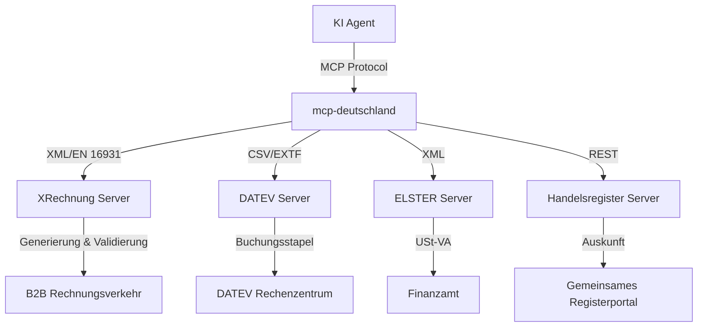

# mcp-deutschland

<div align="center">
  
  
  
</div>


> MCP-Server für die deutsche Verwaltungs- und Wirtschaftsinfrastruktur.

Deutschland hat die komplexeste Verwaltungslandschaft Europas. Diese MCP-Server machen sie für KI-Agenten zugänglich.

Mit der Einführung der verpflichtenden E-Rechnung ab 2025/2028 (EN 16931, XRechnung) und der kontinuierlichen Digitalisierung von Steuer- und Registerdaten wird die Schnittstelle zwischen KI und deutscher Bürokratie zum Flaschenhals. Dieses Monorepo bietet standardisierte, hochgradig typisierte und rechtskonforme Model Context Protocol (MCP) Server für die essenziellen Knotenpunkte der deutschen Wirtschaft.

## Architektur



## Module

### XRechnung/ZUGFeRD (Höchste Priorität)
Vollständige Implementierung zur Generierung und Validierung von XRechnungen nach EN 16931 (UBL 2.1). Erzeugt valides XML für den sofortigen Einsatz.
- `create_invoice`, `validate_invoice`, `convert_to_zugferd`, `parse_invoice`

### DATEV
Erzeugung von EXTF (DATEV-Format) CSV-Dateien für den sicheren und standardisierten Datenaustausch mit Steuerberatern.
- `generate_extf`, `parse_extf`, `validate_extf`

### ELSTER
XML-Schema-Generierung für USt-VA (Umsatzsteuervoranmeldung) zur Weiterverarbeitung über die ERiC-Bibliothek.
- `generate_ustva_xml`, `validate_ustva`

### Handelsregister
Read-only Lookup zur automatisierten Verifizierung von Unternehmensstammdaten.
- `search_company`, `get_company_profile`

## Legal Constraints Matrix

| Modul | Status | Rechtliche Einschränkungen |
|---|---|---|
| XRechnung | Fully Automatable | Streng nach EN 16931, bedarf korrekter USt-Ids |
| DATEV | Semi-Automated | Setzt OAuth 2.0 via SmartLogin & RZ-Zugang voraus |
| ELSTER | Hybrid | Benötigt C-Lib (ERiC) des Bayerischen Landesamts für Steuern |
| Handelsregister | Automatable | Öffentliche Registerdaten, keine Gewährleistung für Richtigkeit |

## Setup
```bash
npm install
npm run build
```

---

**Teil des Agentic Commerce Stack von Matteo Ise:**

- [well-known-mcp](https://github.com/matteo-ise/well-known-mcp) — Discovery-Standard für KI-Agenten
- [agent-wallet-sdk](https://github.com/matteo-ise/agent-wallet-sdk) — Unified Payment Infrastructure für Agenten
- [agent-governance](https://github.com/matteo-ise/agent-governance) — Audit, Compliance & Human-Escalation
- [mcp-deutschland](https://github.com/matteo-ise/mcp-deutschland) — MCP-Server für ELSTER, DATEV, XRechnung
- [mcp-handelsregister](https://github.com/matteo-ise/mcp-handelsregister) — Deutsches Handelsregister für Agenten
- [agentic-commerce-sdk](https://github.com/matteo-ise/agentic-commerce-sdk) — Agent-to-Agent Commerce
- [agentic-maturity-model](https://github.com/matteo-ise/agentic-maturity-model) — Reifegrad-Framework (Stufe 0→5)
- [kontorstack](https://github.com/matteo-ise/kontorstack) — Full-Stack Framework für agentische Unternehmen

[Matteo Ise auf GitHub](https://github.com/matteo-ise) · [X/Twitter](https://x.com/matteoise)
